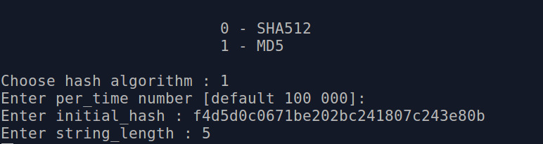
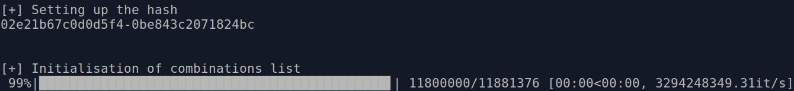

Zombie_Pass_Cracker
=================

This is a distributed password cracker for linux system.

supported hashes:
* MD5
* SHA512

We will add more supported hashes in the future as well as optimizing the code for better performance.

Disclaimer 
------------
The author of this project will not be held responsible in the event any criminal charges be brought against any individuals misusing the information in this website to break the law.

Don't use it for a bad purpose the world is already full of evil.

**"The world is a dangerous place to live; not because of the people who are evil, but because of the people who don't do anything about it."** 
--Albert Einstein

How to run
------------

1) Run the python server **server.py**.

2) run **make.sh** to compile the client.

Authors
-------
BITAM Salim [github.com/soolidsnake](https://github.com/soolidsnake).

MALAOUI Sidahmed bilal [github.com/sidahmed-malaoui](https://github.com/sidahmed-malaoui).

License
-------

GNU General Public License v3.0
